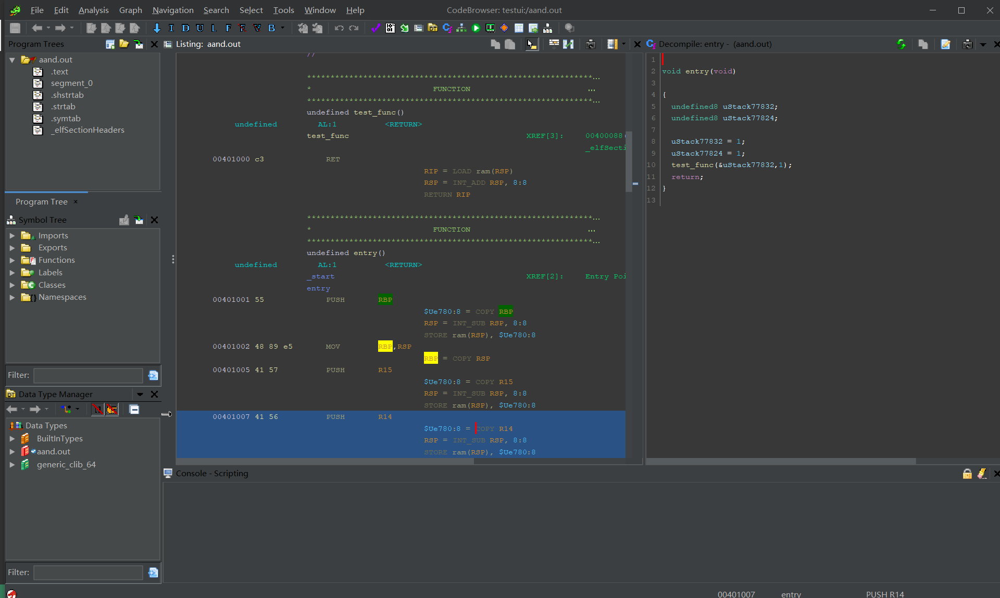

# BinCraft - Binary Analysis Craft!

BinCraft is a ghidra release by [StarCrossTech PortalLab](https://www.starcross.tech/#/).

Features:

- useful default plugins (todo)
- quicker issue fixed ghidra
- modern style ghidra
- anything useful but ghidra does not love to see!
- useful ghidra-based libraries/tools

We already have a Dark Themed Ghidra!

## Projects

bincraft is composed by various projects, each for its own goal.

Now we have:

- [sleighcraft](https://github.com/StarCrossPortal/sleighcraft): ghidra-based Rust/Python/NodeJS disassembler/lifter that works as a library
- [ghidracraft](https://github.com/StarCrossPortal/ghidracraft): forked version of ghidra that adds possible default extensions, dark themed UI, etc.
    - [ghidracraft book](https://github.com/StarCrossPortal/ghidracraft-book): if you want documentation about the ghidracraft project.
- [pcodecraft](https://github.com/StarCrossPortal/pcodecraft): Rust abstraction over ghidra decompiler objects.
- more under construction!